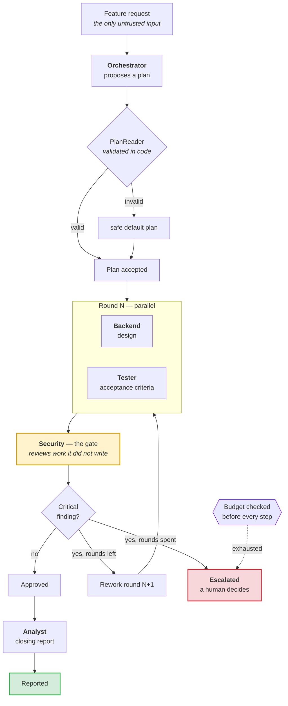
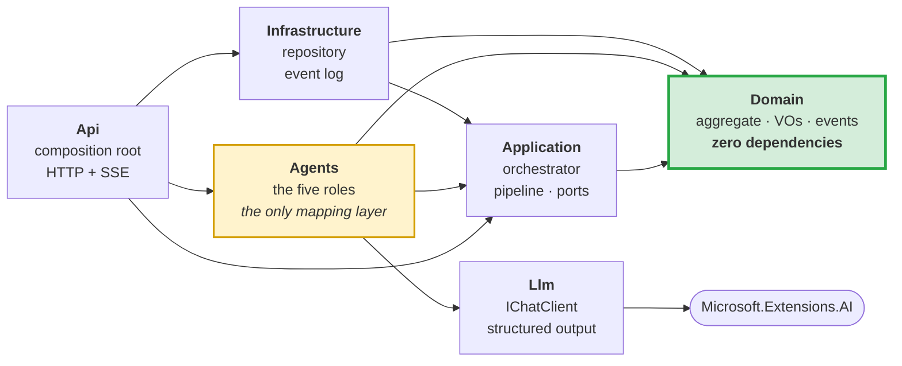

# AgentForge

**A multi-agent delivery pipeline in .NET 10 — built the way a production system would be, not the way a demo is.**

[](https://github.com/turuncfatih/agentforge/actions/workflows/ci.yml)
[](LICENSE)

🇬🇧 English · [🇹🇷 Türkçe](README.tr.md)

Five agents collaborate on a software feature request: an **orchestrator** plans
the work, a **backend** and a **tester** work in parallel, a **security** agent
reviews what it did not write and can *stop delivery*, and an **analyst** writes
the closing report. A blocked review sends the round back — at most twice, then
a human takes over.

The interesting part is not the agents. It is everything around them: the budget
that cannot be exceeded, the veto that cannot be talked around, the steps that
cannot be charged twice, and the audit trail that explains the decision months
later.

```
39 tests · 0 API keys · ~140 ms
```

> **Companion repositories.** This repo is the machinery. The other two are the
> judgment and the practice:
> [Agent Team Playbook](https://github.com/turuncfatih/agent-team-playbook) — how to cut a project into agent roles, what each
> role's contract must contain, and which model tier each one gets.
> [Claude Web Workflow](https://github.com/turuncfatih/claude-web-workflow) — one team applied end to end, building a website.

---

## Table of contents

- [What this is, and what it is not](#what-this-is-and-what-it-is-not)
- [The problem it addresses](#the-problem-it-addresses)
- [How it works](#how-it-works)
- [The five roles](#the-five-roles)
- [A real run, annotated](#a-real-run-annotated)
- [Five decisions that carry the repository](#five-decisions-that-carry-the-repository)
- [Layering and the dependency rule](#layering-and-the-dependency-rule)
- [Project structure](#project-structure)
- [Running it](#running-it)
- [The test suite](#the-test-suite)
- [Where this pattern applies](#where-this-pattern-applies)
- [Deliberately not built](#deliberately-not-built)
- [Architecture decision records](#architecture-decision-records)

---

## What this is, and what it is not

**It is** a reference architecture for multi-agent systems on .NET, small enough
to read in one sitting and complete enough to run end to end.

**It is not** a product, a framework, or something to `dotnet add package`. The
deliverable here is the set of decisions — the code exists to prove they hold.

If you read only two files, read
[ADR-0004](docs/adr/0004-the-domain-does-not-know-that-language-models-exist.md)
(the boundary everything else is built around) and
[ADR-0010](docs/adr/0010-what-was-deliberately-not-built.md) (what was left out,
and why).

---

## The problem it addresses

By 2026 nearly every engineering organisation has built an LLM proof of concept.
Far fewer have put one into production. The reasons repeat:

| The recurring complaint | The answer in this repository |
|---|---|
| *"Cost ran away and the invoice was a shock."* | `Budget` is a domain concept with four ceilings — steps, tokens, money, rework loops. Exceeding one is a **business outcome** (`Escalated`), not an exception. [ADR-0009](docs/adr/0009-budget-is-a-domain-concept.md) |
| *"A hallucination reached the customer."* | A **blocking gate**: one agent reviews work it did not produce and can stop delivery. A `Critical` finding cannot be approved away. [ADR-0002](docs/adr/0002-supervisor-orchestration-with-a-blocking-gate.md) |
| *"The process died halfway and started over."* | Step ids are **derived, not generated**. Re-running skips settled work instead of repeating it, and a step cannot settle twice. [ADR-0006](docs/adr/0006-deterministic-step-ids-instead-of-a-workflow-engine.md) |
| *"An auditor asked why it decided that, and we had nothing."* | An **append-only domain event log**, streamed over SSE. The sequence of events *is* the explanation. |
| *"We could not test it — every run was different."* | Every test runs against a **deterministic scripted provider**. No API key, no network, no cost, same result every time. [ADR-0005](docs/adr/0005-microsoft-extensions-ai-as-the-provider-boundary.md) |

One sentence: **five reasons agent systems stall before production, and an
architectural answer to each.**

---

## How it works



The state machine behind it:

```
Planned → Executing → Gating → ┬→ Approved → Reported
                               └→ Reworking → Executing   (bounded)

                    Escalated ←── budget exhausted, or rework exhausted
                    Failed    ←── a step failed irrecoverably
```

Every transition lives on the `DeliveryTask` aggregate, and every one of them is
covered by a test that names the rule it protects.

---

## The five roles

An agent here is a **role, not a model**. What distinguishes them is not their
prompt — it is their *capability*, and capability comes from configuration.

| Agent | Produces | Tools | Veto | Token ceiling |
|---|---|---|:---:|---:|
| **Orchestrator** | The plan | *none — it may think, never act* | ✗ | 8 000 |
| **Backend** | Technical design | `repo.read`, `schema.validate` | ✗ | 20 000 |
| **Tester** | Acceptance criteria | `repo.read`, `test.plan` | ✗ | 15 000 |
| **Security** | Findings | `repo.read`, `cve.lookup` | ✅ | 20 000 |
| **Analyst** | Closing report | `metrics.read` | ✗ | 12 000 |

Three rules make that table real rather than decorative:

1. **Only a veto-holding agent may raise a blocking finding.** If the backend
   agent labels its opinion `Critical`, middleware downgrades it to `High`.
   *Test: `An_agent_without_veto_power_cannot_block_delivery_by_shouting_Critical`*
2. **Only a veto-holding agent may be appointed as the gate.** The orchestrator
   proposes; `PlanReader` rejects a plan that hands the gate to anyone else.
   *Test: `A_plan_that_appoints_a_gate_without_veto_power_is_rejected`*
3. **The gate cannot be a worker.** A reviewer must review work it did not
   produce — enforced in the `DeliveryPlan` constructor.

---

## A real run, annotated

Actual output from `POST /deliveries`, with the request *"Customers can cancel
their own orders"*:

| # | Step id | Agent | Round | Tokens | What happened |
|---|---|---|:---:|---:|---|
| 1 | `…:orchestrator:r0` | orchestrator | 0 | 383 | Proposed backend + tester, security as gate. **Validated in code before acceptance.** |
| 2 | `…:backend:r0` | backend | 0 | 371 | Designed `POST /orders/{id}/cancel` |
| 3 | `…:tester:r0` | tester | 0 | 377 | Derived five acceptance cases |
| 4 | `…:security:r0` | security | 0 | 565 | 🔴 **Critical: endpoint does not verify order ownership** |
| — | — | *gate* | 0 | — | **Blocked.** Round 0 does not ship. |
| 5 | `…:backend:r1` | backend | 1 | 613 | Revised: authorises against `Order.CustomerId`, emits audit event |
| 6 | `…:tester:r1` | tester | 1 | 598 | Re-derived criteria against the revision |
| 7 | `…:security:r1` | security | 1 | 788 | ✅ Blocking issue resolved; one `Low` note remains |
| 8 | `…:analyst:r1` | analyst | 1 | 757 | Report, including the knowingly accepted residual risk |

```
state: Reported   round: 1   steps: 8   tokens: 4 452   cost: $0.0229
```

The finding that blocked round 0 — note that **evidence is mandatory**, because
the gate is not allowed to stop delivery on an opinion:

```json
{
  "severity": "Critical",
  "raisedBy": "security",
  "category": "authorization",
  "title": "Cancellation endpoint does not verify order ownership",
  "evidence": "The design for POST /orders/{id}/cancel describes the state transition but never checks the caller against Order.CustomerId, so any authenticated user could cancel any order.",
  "suggestedFix": "Authorise the caller against Order.CustomerId before the transition, and record an audit event."
}
```

And the audit trail the same run produced — this is what you hand an auditor:

```
1  DeliveryStarted      6  StepOpened        11  GateEvaluated  ← blocked
2  StepOpened           7  StepSettled       12  ReworkRequested
3  StepSettled          8  StepSettled       13  StepOpened
4  PlanAccepted         9  StepOpened        …
5  StepOpened          10  StepSettled       n  DeliveryReported
```

---

## Five decisions that carry the repository

### 1. The domain does not know that language models exist

`AgentForge.Domain` references **nothing but the base class library**. No SDK, no
logging, no DI, no serializer. It records *that work happened and what it cost*:

> "Step `security:r0` settled with outcome Completed, one Critical finding,
> 565 tokens, $0.0032."

Whether that came from a model, a rules engine or a person is not its concern.

This is the decision most LLM codebases lose gradually — a prompt string in a
service, then a `ChatMessage` in a signature, then a vendor type in the business
rules. So it is **asserted, not requested**:

```csharp
[Fact]
public void The_domain_depends_on_nothing_but_the_base_class_library()
{
    var foreign = Domain.GetReferencedAssemblies()
        .Select(a => a.Name!)
        .Where(name => !name.StartsWith("System.", StringComparison.Ordinal)
                       && name is not ("System" or "netstandard" or "mscorlib"))
        .ToArray();

    Assert.True(foreign.Length == 0, $"…but it references: {string.Join(", ", foreign)}");
}
```

A second test fails the build if any public domain member is named after a
prompt, a model or a vendor. → [ADR-0004](docs/adr/0004-the-domain-does-not-know-that-language-models-exist.md)

### 2. Business rules live on the aggregate, not in the orchestrator

The orchestrator reads like a script. Every decision that could be *wrong*
belongs to `DeliveryTask`:

```csharp
public GateDecision RunGate(IGatePolicy policy, DateTimeOffset now)
{
    Ensure.That(Plan!.ParallelWorkers.All(HasSettledStep),
        "The gate may only run once every worker in this round has settled.");
    Ensure.That(HasSettledStep(Plan.Gate),
        "The gate agent must produce its own step before its findings can be judged.");

    var decision = policy.Evaluate(FindingsOfThisRound());
    Raise(new GateEvaluated(Id, Round, decision, blocking, now));

    if (decision is GateDecision.Passed) { State = DeliveryState.Approved; … }

    // Out of rework budget? A human decides — the gate never approves.
    if (Round >= Budget.MaxReworkLoops) { Escalate(…); return decision; }

    State = DeliveryState.Reworking;
    return decision;
}
```

The orchestrator calls this and obeys the answer. It cannot approve a blocked
delivery, because it was never given the ability to. → [ADR-0003](docs/adr/0003-tactical-ddd-without-ceremony.md)

### 3. Step ids are derived, which is what makes resume free

```csharp
StepId.For(task, agent, round)   // → "01a0b9b3:backend:r1"
```

The same task, agent and round always produce the same id. Three properties
follow from that one line:

- **Resume** — before running an agent, the orchestrator asks the aggregate
  `HasSettledStep(agent)` and skips what is already paid for.
- **Idempotency** — `AgentStep.Settle` throws if the step already settled, so a
  duplicate result cannot be charged twice.
- **Replay** — the event log is append-only, so replaying it rebuilds the state.

```csharp
[Fact]
public async Task Rerunning_a_finished_delivery_repeats_no_work()
{
    var first  = await harness.RunAsync(id);
    var calls  = harness.Client.CallCount;
    var second = await harness.RunAsync(id);

    Assert.Equal(calls, harness.Client.CallCount);   // zero further model calls
}
```

Event sourcing's useful half, without the framework. → [ADR-0006](docs/adr/0006-deterministic-step-ids-instead-of-a-workflow-engine.md)

### 4. Cross-cutting concerns are middleware, not prompt instructions

"Please do not exceed your budget" is a request. This is a control:

```
telemetry → injection-shield → budget-guard → retry → output-policy → agent
```

| Stage | Responsibility |
|---|---|
| `telemetry` | One `Activity` span per step, tagged with tokens and cost |
| `injection-shield` | Neutralises instruction-like text in the untrusted request |
| `budget-guard` | Enforces the per-step token ceiling from the agent's policy |
| `retry` | Exponential backoff, **carrying forward the spend of failed attempts** |
| `output-policy` | Validates the response against the agent's own capabilities |

The order is load-bearing, so a test asserts it, and `GET /pipeline` returns the
live chain. Two details worth stealing:

- **Retry sits inside the budget guard**, and accumulates the tokens of failed
  attempts. Dropping them would make the most expensive run look like the
  cheapest one.
- **`output-policy` sits closest to the agent**, so it judges raw output before
  any other stage reshapes it.

→ [ADR-0007](docs/adr/0007-cross-cutting-concerns-as-agent-middleware.md)

### 5. A model proposes; code disposes

The orchestrator agent is asked to plan. Its answer is then put through a gate
of its own:

```csharp
if (!registry.Resolve(gate).Policy.CanVeto)
{
    throw new InvalidOperationException(
        $"plan appoints '{gate}' as the gate, but that role has no veto power. "
        + "Capability comes from configuration, not from the plan.");
}
```

Unknown role, or a gate without veto power, and the plan is rejected in favour of
the safe default — logged, never silent. This is the seam where a language
model's *suggestion* becomes a system *decision*. → [ADR-0008](docs/adr/0008-capability-lives-in-configuration-not-in-prompts.md)

---

## Layering and the dependency rule



Read the arrows: **everything points inwards, and nothing points at `Llm` except
`Agents`.**

- `Domain` depends on nothing. Not even logging.
- `Llm` does not reference `Domain` either — it has its own `LlmUsage` type.
- `Agents` is the **only** assembly that references both. That single place is
  where an `LlmUsage` becomes a `TokenUsage`.

Two near-identical usage types exist on purpose. The moment they are merged, the
boundary is gone. Both facts are asserted by `LayeringTests`.

---

## Project structure

```
src/
  AgentForge.Domain/            ← the aggregate, the rules, zero dependencies
    Abstractions/               AggregateRoot, IDomainEvent, Ensure
    Delivery/                   DeliveryTask, Budget, Finding, GatePolicy, Events/
  AgentForge.Application/       ← orchestration and ports
    Agents/                     IAgent, AgentPolicy, Blackboard, AgentPipeline
    Agents/Middleware/          telemetry · shield · budget · retry · output-policy
    Orchestration/              DeliveryOrchestrator
    Ports/                      repository · event sink · plan reader · registry
  AgentForge.Agents/            ← the five roles + the LLM↔domain mapping
  AgentForge.Llm/               ← IChatClient boundary, structured output, ScriptedChatClient
  AgentForge.Infrastructure/    ← in-memory repository, append-only event log
  AgentForge.Api/               ← composition root, HTTP, SSE
tests/
  AgentForge.Domain.Tests/      ← invariants + architecture tests
  AgentForge.Application.Tests/ ← end-to-end orchestration + guardrails
docs/
  adr/                          ← ten decision records  ★ the actual deliverable
  glossary.md                   ← ubiquitous language
```

---

## Running it

Requires the **.NET 10 SDK**. Nothing else — no API key, no database, no container.

```bash
git clone <repo-url> && cd agentforge
dotnet test                                  # 39 tests, ~140 ms
dotnet run --project src/AgentForge.Api
```

Then run a delivery:

```bash
curl -X POST http://localhost:5199/deliveries \
  -H 'Content-Type: application/json' \
  -d '{
        "title": "Customers can cancel their own orders",
        "description": "Let a customer cancel an order they placed, while it has not shipped yet.",
        "acceptanceCriteria": ["Only the customer who placed the order may cancel it"]
      }'
```

| Endpoint | Purpose |
|---|---|
| `POST /deliveries` | Run a delivery to completion |
| `GET /deliveries/{id}` | Current state, timeline, findings, cost |
| `GET /deliveries/{id}/events` | The append-only audit trail, streamed over SSE |
| `GET /pipeline` | The middleware order every agent call passes through |

The demo runs against `ScriptedChatClient`. Pointing it at a live model is one
line in `Program.cs`:

```csharp
builder.Services.AddSingleton<IChatClient>(_ => DemoScript.OrderCancellation());
//                                              ↑ swap for any IChatClient adapter
```

---

## The test suite

39 tests, no API key, ~140 ms. Each one names the rule it protects — the test
list reads as a specification.

**Domain invariants** — *what must never happen*

| Test | The rule |
|---|---|
| `A_step_settles_exactly_once_so_a_replay_cannot_double_charge` | Idempotency |
| `No_step_may_open_once_the_step_budget_is_spent` | The budget is a hard ceiling |
| `A_blocking_finding_cannot_be_approved_away` | The gate is not advisory |
| `The_gate_cannot_run_before_every_worker_has_settled` | Review order |
| `Rework_is_bounded_and_a_task_that_keeps_failing_goes_to_a_human` | No infinite loops |
| `A_report_cannot_be_published_before_the_gate_approves` | Legal transitions only |
| `A_finding_without_evidence_is_rejected…` | The gate may not block on an opinion |
| `The_gate_agent_may_not_also_be_a_worker` | No self-review |

**Guardrails** — *what an agent may not do*

| Test | The rule |
|---|---|
| `An_agent_without_veto_power_cannot_block_delivery_by_shouting_Critical` | Capability is configuration |
| `A_plan_that_appoints_a_gate_without_veto_power_is_rejected` | A model proposes, code disposes |
| `Instruction_like_text_in_an_untrusted_request_is_neutralised` | Injection defence in depth |
| `A_step_that_blows_past_its_token_ceiling_fails_instead_of_returning_work` | Per-step spend control |
| `The_middleware_order_is_part_of_the_design_and_is_asserted_here` | Order is load-bearing |

**End to end** — *the whole machine*

| Test | The behaviour |
|---|---|
| `A_blocked_review_triggers_rework_and_the_second_pass_ships` | The full loop |
| `Rerunning_a_finished_delivery_repeats_no_work` | Resume costs nothing |
| `A_delivery_that_never_satisfies_the_gate_escalates…` | Bounded, then human |
| `A_delivery_that_runs_out_of_budget_escalates_rather_than_overspending` | Cost ceiling holds |
| `The_audit_trail_explains_the_decision_without_reading_any_code` | Auditability |

**Architecture** — *the boundary itself*

`The_domain_depends_on_nothing_but_the_base_class_library`,
`No_domain_type_knows_that_language_models_exist`,
`The_llm_layer_does_not_know_the_domain_either`,
`Mapping_between_the_two_happens_in_exactly_one_place`.

> One of these tests found a real bug during development: the budget was checked
> once per *round*, but a round opens several steps — so a ceiling reached
> halfway through a round was overspent by a whole round. The check now runs per
> step. It is recorded in [ADR-0009](docs/adr/0009-budget-is-a-domain-concept.md).

---

## Where this pattern applies

The scenario is software delivery, but the skeleton is domain-agnostic. Rename
the roles and the same architecture holds:

| Domain | Workers | Gate (veto) |
|---|---|---|
| **Lending** | Financial analysis, scoring | **Compliance** — regulatory breach stops the decision |
| **Insurance claims** | Document extraction, policy check | **Fraud** — suspicion routes to a human |
| **Contract review** | Clause extraction, risk analysis | **Legal/privacy** — a GDPR breach blocks sign-off |
| **Customer support** | Classification, drafting | **Policy** — a reply outside the refund policy never sends |
| **Clinical intake** | History, literature | **Clinician approval** — an unconditional human gate |

The shared shape: **a multi-step task, specialist roles, an expensive mistake,
and an obligation to explain the decision afterwards.** When all four are
present, an orchestrator with a blocking gate and a metered budget is the right
structure. When they are not, a single well-written model call usually is —
and reaching for this would be over-engineering.

---

## Deliberately not built

Restraint is a design decision, so it is documented like one.

| Left out | Why |
|---|---|
| A real database | The port is what the application depends on; the in-memory adapter implements it, optimistic concurrency included. Swapping in EF Core changes one registration. |
| Tool execution | Tools are modelled on the policy but not executed. A sandbox worth shipping is its own project; a fake one would be theatre. |
| A workflow engine | Deterministic step ids plus checkpoints give resume and idempotency without the dependency. |
| Full event sourcing | The step log is already append-only and replayable. A framework, projections and a versioning story would be the expensive half. |
| A UI | The audit trail streams over SSE. A dashboard would demonstrate frontend work, which this repository does not claim. |
| Vector store / RAG | Nothing here needs retrieval. Adding it to look current would be the same mistake as over-applying DDD. |

**Honest limitations.** The in-memory repository loses everything on restart —
the resume path is real and tested, the storage behind it is not yet durable.
The injection shield is pattern-based: it lowers the blast radius of a hostile
request, it does not make injection impossible. The evaluation bounded context
is named in ADR-0003 and reserved, not implemented.

→ [ADR-0010](docs/adr/0010-what-was-deliberately-not-built.md)

---

## Architecture decision records

| # | Decision |
|---|---|
| [0001](docs/adr/0001-record-architecture-decisions.md) | Record architecture decisions |
| [0002](docs/adr/0002-supervisor-orchestration-with-a-blocking-gate.md) | Supervisor orchestration with a blocking gate |
| [0003](docs/adr/0003-tactical-ddd-without-ceremony.md) | Tactical DDD, without the ceremony |
| [0004](docs/adr/0004-the-domain-does-not-know-that-language-models-exist.md) | **The domain does not know that language models exist** |
| [0005](docs/adr/0005-microsoft-extensions-ai-as-the-provider-boundary.md) | Microsoft.Extensions.AI as the provider boundary |
| [0006](docs/adr/0006-deterministic-step-ids-instead-of-a-workflow-engine.md) | Deterministic step ids instead of a workflow engine |
| [0007](docs/adr/0007-cross-cutting-concerns-as-agent-middleware.md) | Cross-cutting concerns as agent middleware |
| [0008](docs/adr/0008-capability-lives-in-configuration-not-in-prompts.md) | Capability lives in configuration, not in prompts |
| [0009](docs/adr/0009-budget-is-a-domain-concept.md) | Budget is a domain concept |
| [0010](docs/adr/0010-what-was-deliberately-not-built.md) | **What was deliberately not built** |

See also the [glossary](docs/glossary.md) — the ubiquitous language, and the
words this codebase avoids.

---

**Stack** · .NET 10 · Microsoft.Extensions.AI · Minimal API · SSE · xUnit
**Licence** · MIT
