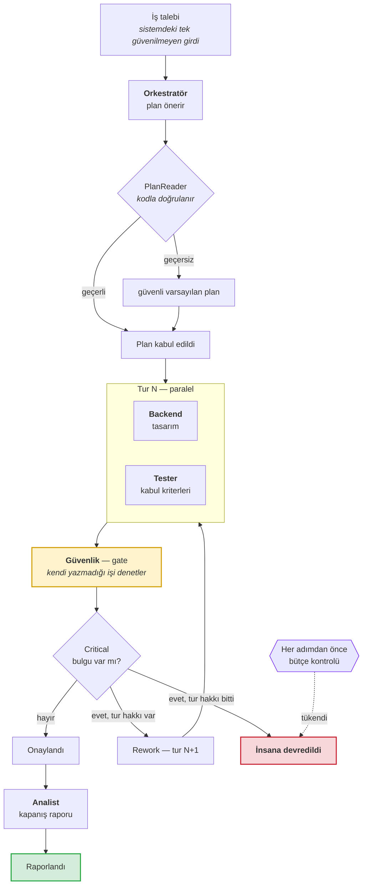
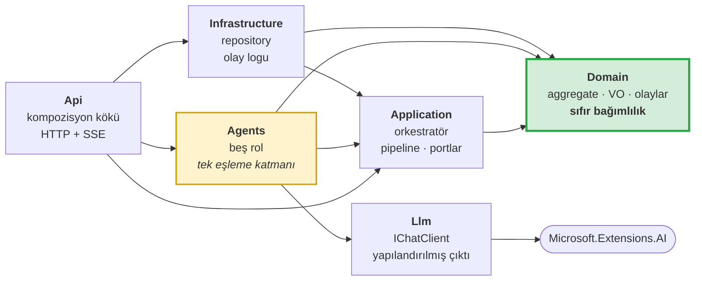

# AgentForge

**.NET 10 ile çok ajanlı teslimat hattı — demo gibi değil, üretim sistemi gibi kurgulanmış.**

[](https://github.com/turuncfatih/agentforge/actions/workflows/ci.yml)
[](LICENSE)

[🇬🇧 English](README.md) · 🇹🇷 Türkçe

Beş ajan bir yazılım talebi üzerinde birlikte çalışıyor: **orkestratör** planı
kurar, **backend** ve **tester** paralel çalışır, **güvenlik** ajanı kendi
yazmadığı işi denetler ve *teslimatı durdurabilir*, **analist** kapanış raporunu
yazar. Denetim bloklarsa tur geri döner — en fazla iki kez, sonrası insana kalır.

Asıl mesele ajanlar değil. Etraflarındaki her şey: aşılamayan bütçe, ikna
edilemeyen veto, iki kez faturalanamayan adımlar ve aylar sonra kararı
açıklayabilen denetim izi.

```
39 test · 0 API anahtarı · ~140 ms
```

> **Kardeş repolar.** Bu repo makineyi gösteriyor; diğer ikisi muhakemeyi ve
> pratiği:
> [Agent Team Playbook](https://github.com/turuncfatih/agent-team-playbook) — bir projeyi ajan rollerine nasıl kesersin, her
> rolün sözleşmesinde ne bulunmalı, hangisine hangi model katmanı verilir.
> [Claude Web Workflow](https://github.com/turuncfatih/claude-web-workflow) — o yöntemin uçtan uca uygulanmış hali: site yapımı.

---

## İçindekiler

- [Bu nedir, ne değildir](#bu-nedir-ne-değildir)
- [Hangi derde deva](#hangi-derde-deva)
- [Nasıl çalışıyor](#nasıl-çalışıyor)
- [Beş rol](#beş-rol)
- [Gerçek bir koşu](#gerçek-bir-koşu)
- [Repoyu taşıyan beş karar](#repoyu-taşıyan-beş-karar)
- [Katmanlar ve bağımlılık kuralı](#katmanlar-ve-bağımlılık-kuralı)
- [Proje yapısı](#proje-yapısı)
- [Çalıştırma](#çalıştırma)
- [Test paketi](#test-paketi)
- [Bu kalıp hangi sektörlerde işe yarar](#bu-kalıp-hangi-sektörlerde-işe-yarar)
- [Bilerek yapılmayanlar](#bilerek-yapılmayanlar)
- [Mimari karar kayıtları](#mimari-karar-kayıtları)

---

## Bu nedir, ne değildir

**Nedir:** .NET üzerinde çok ajanlı sistemler için bir referans mimari. Tek
oturumda okunacak kadar küçük, uçtan uca çalışacak kadar tam.

**Ne değildir:** ürün değil, framework değil, `dotnet add package` ile
kurulacak bir şey değil. Buradaki asıl teslimat **kararlar**; kod, o kararların
gerçekten tuttuğunu kanıtlamak için var.

Sadece iki dosya okuyacaksan:
[ADR-0004](docs/adr/0004-the-domain-does-not-know-that-language-models-exist.md)
(her şeyin üzerine kurulduğu sınır) ve
[ADR-0010](docs/adr/0010-what-was-deliberately-not-built.md) (neyin bilerek
yapılmadığı ve nedeni).

---

## Hangi derde deva

2026 itibarıyla neredeyse her mühendislik ekibi bir LLM POC'u yaptı. Üretime
alabilen çok daha az. Sebepler hep aynı:

| Sık duyulan şikâyet | Bu repodaki cevap |
|---|---|
| *"Maliyet kontrolden çıktı, fatura şok etti."* | `Budget` bir domain kavramı: adım, token, para ve rework turu olmak üzere dört tavan. Tavanı aşmak bir **iş sonucu** (`Escalated`), istisna değil. [ADR-0009](docs/adr/0009-budget-is-a-domain-concept.md) |
| *"Halüsinasyon müşteriye gitti."* | **Bloklayan gate**: bir ajan kendi üretmediği işi denetler ve teslimatı durdurabilir. `Critical` bir bulgu onaylanarak geçiştirilemez. [ADR-0002](docs/adr/0002-supervisor-orchestration-with-a-blocking-gate.md) |
| *"Süreç ortada öldü, baştan başladı."* | Adım kimlikleri **üretilmiyor, türetiliyor**. Yeniden çalıştırma tamamlanmış işi atlar; bir adım iki kez kapanamaz. [ADR-0006](docs/adr/0006-deterministic-step-ids-instead-of-a-workflow-engine.md) |
| *"Denetçi 'neden böyle karar verdi' diye sordu, elimizde bir şey yoktu."* | **Append-only domain event logu**, SSE ile canlı akıyor. Olay dizisinin kendisi açıklamadır. |
| *"Test edemedik, her koşu farklıydı."* | Bütün testler **deterministik scripted sağlayıcı** üzerinde koşuyor. API anahtarı yok, ağ yok, maliyet yok, sonuç hep aynı. [ADR-0005](docs/adr/0005-microsoft-extensions-ai-as-the-provider-boundary.md) |

Tek cümleyle: **ajan sistemlerinin üretime geçememesinin beş sebebi var, her
birine mimari bir cevap.**

---

## Nasıl çalışıyor



Arkasındaki durum makinesi:

```
Planned → Executing → Gating → ┬→ Approved → Reported
                               └→ Reworking → Executing   (sınırlı)

                    Escalated ←── bütçe bitti ya da rework hakkı bitti
                    Failed    ←── bir adım kurtarılamaz şekilde başarısız
```

Her geçiş `DeliveryTask` aggregate'i üzerinde yaşar ve her biri, koruduğu kuralı
adıyla söyleyen bir testle kapsanmıştır.

---

## Beş rol

Buradaki ajan bir **rol, model değil**. Onları ayıran şey prompt'ları değil —
*yetkileri*, ve yetki konfigürasyondan gelir.

| Ajan | Ürettiği | Araçlar | Veto | Token tavanı |
|---|---|---|:---:|---:|
| **Orkestratör** | Plan | *yok — düşünebilir, eyleyemez* | ✗ | 8 000 |
| **Backend** | Teknik tasarım | `repo.read`, `schema.validate` | ✗ | 20 000 |
| **Tester** | Kabul kriterleri | `repo.read`, `test.plan` | ✗ | 15 000 |
| **Güvenlik** | Bulgular | `repo.read`, `cve.lookup` | ✅ | 20 000 |
| **Analist** | Kapanış raporu | `metrics.read` | ✗ | 12 000 |

Bu tabloyu süs olmaktan çıkaran üç kural:

1. **Sadece veto yetkisi olan ajan bloklayan bulgu üretebilir.** Backend ajanı
   kendi görüşünü `Critical` diye etiketlerse, middleware onu `High`'a indirir.
   *Test: `An_agent_without_veto_power_cannot_block_delivery_by_shouting_Critical`*
2. **Sadece veto yetkisi olan ajan gate olarak atanabilir.** Orkestratör önerir;
   `PlanReader` gate'i başkasına veren planı reddeder.
   *Test: `A_plan_that_appoints_a_gate_without_veto_power_is_rejected`*
3. **Gate aynı zamanda işçi olamaz.** Denetleyen, kendi üretmediği işi
   denetlemelidir — `DeliveryPlan` kurucusunda zorlanır.

---

## Gerçek bir koşu

*"Müşteriler kendi siparişlerini iptal edebilsin"* talebiyle `POST /deliveries`
çıktısı:

| # | Adım kimliği | Ajan | Tur | Token | Ne oldu |
|---|---|---|:---:|---:|---|
| 1 | `…:orchestrator:r0` | orkestratör | 0 | 383 | Backend + tester, gate güvenlik önerdi. **Kabul edilmeden önce kodla doğrulandı.** |
| 2 | `…:backend:r0` | backend | 0 | 371 | `POST /orders/{id}/cancel` tasarımı |
| 3 | `…:tester:r0` | tester | 0 | 377 | Beş kabul senaryosu türetti |
| 4 | `…:security:r0` | güvenlik | 0 | 565 | 🔴 **Critical: endpoint sipariş sahipliğini doğrulamıyor** |
| — | — | *gate* | 0 | — | **Bloklandı.** Tur 0 teslim edilmiyor. |
| 5 | `…:backend:r1` | backend | 1 | 613 | Revize: `Order.CustomerId` yetkilendirmesi + audit event |
| 6 | `…:tester:r1` | tester | 1 | 598 | Kriterleri revizyona göre yeniden türetti |
| 7 | `…:security:r1` | güvenlik | 1 | 788 | ✅ Bloklayan sorun çözüldü; bir `Low` not kaldı |
| 8 | `…:analyst:r1` | analist | 1 | 757 | Rapor — bilerek kabul edilen artık risk dahil |

```
durum: Reported   tur: 1   adım: 8   token: 4 452   maliyet: $0,0229
```

Tur 0'ı bloklayan bulgu — **kanıt zorunlu**, çünkü gate bir görüşe dayanarak
teslimatı durduramaz:

```json
{
  "severity": "Critical",
  "raisedBy": "security",
  "category": "authorization",
  "title": "Cancellation endpoint does not verify order ownership",
  "evidence": "The design for POST /orders/{id}/cancel describes the state transition but never checks the caller against Order.CustomerId, so any authenticated user could cancel any order.",
  "suggestedFix": "Authorise the caller against Order.CustomerId before the transition, and record an audit event."
}
```

Aynı koşunun ürettiği denetim izi — denetçiye verilecek şey tam olarak bu:

```
1  DeliveryStarted      6  StepOpened        11  GateEvaluated  ← bloklandı
2  StepOpened           7  StepSettled       12  ReworkRequested
3  StepSettled          8  StepSettled       13  StepOpened
4  PlanAccepted         9  StepOpened        …
5  StepOpened          10  StepSettled       n  DeliveryReported
```

---

## Repoyu taşıyan beş karar

### 1. Domain, dil modellerinin var olduğunu bilmez

`AgentForge.Domain` **temel sınıf kütüphanesi dışında hiçbir şeye** bağımlı
değil. SDK yok, logging yok, DI yok, serializer yok. Domain şunu bilir:

> "`security:r0` adımı Completed sonucuyla kapandı, bir Critical bulgu,
> 565 token, $0,0032."

Bunu bir modelin mi, bir kural motorunun mu, bir insanın mı ürettiği domain'in
umurunda değil.

LLM kod tabanlarının çoğu bu sınırı yavaşça kaybeder — önce bir servise prompt
string'i, sonra bir imzaya `ChatMessage`, sonra iş kurallarına vendor tipi. Bu
yüzden burada **rica edilmiyor, test ediliyor**:

```csharp
[Fact]
public void The_domain_depends_on_nothing_but_the_base_class_library()
{
    var foreign = Domain.GetReferencedAssemblies()
        .Select(a => a.Name!)
        .Where(name => !name.StartsWith("System.", StringComparison.Ordinal)
                       && name is not ("System" or "netstandard" or "mscorlib"))
        .ToArray();

    Assert.True(foreign.Length == 0, $"…ama şunlara bağımlı: {string.Join(", ", foreign)}");
}
```

İkinci bir test, herhangi bir public domain üyesi prompt/model/vendor adı
taşırsa derlemeyi kırıyor. → [ADR-0004](docs/adr/0004-the-domain-does-not-know-that-language-models-exist.md)

### 2. İş kuralları aggregate'te yaşar, orkestratörde değil

Orkestratör bir senaryo gibi okunur. *Yanlış olabilecek* her karar
`DeliveryTask`'a aittir:

```csharp
public GateDecision RunGate(IGatePolicy policy, DateTimeOffset now)
{
    Ensure.That(Plan!.ParallelWorkers.All(HasSettledStep),
        "The gate may only run once every worker in this round has settled.");
    Ensure.That(HasSettledStep(Plan.Gate),
        "The gate agent must produce its own step before its findings can be judged.");

    var decision = policy.Evaluate(FindingsOfThisRound());
    Raise(new GateEvaluated(Id, Round, decision, blocking, now));

    if (decision is GateDecision.Passed) { State = DeliveryState.Approved; … }

    // Rework hakkı bitti mi? Karar insana geçer — gate asla onaylamaz.
    if (Round >= Budget.MaxReworkLoops) { Escalate(…); return decision; }

    State = DeliveryState.Reworking;
    return decision;
}
```

Orkestratör bunu çağırır ve cevabına uyar. Bloklanmış bir teslimatı onaylayamaz,
çünkü ona böyle bir yetenek hiç verilmedi. → [ADR-0003](docs/adr/0003-tactical-ddd-without-ceremony.md)

### 3. Adım kimlikleri türetilir; resume bu yüzden bedava

```csharp
StepId.For(task, agent, round)   // → "01a0b9b3:backend:r1"
```

Aynı görev, aynı ajan ve aynı tur her zaman aynı kimliği üretir. Bu tek satırdan
üç özellik doğar:

- **Resume** — ajanı çalıştırmadan önce orkestratör aggregate'e
  `HasSettledStep(agent)` diye sorar ve parası ödenmiş işi atlar.
- **Idempotency** — `AgentStep.Settle`, adım zaten kapandıysa hata verir; aynı
  sonuç iki kez faturalanamaz.
- **Replay** — olay logu append-only, tekrar oynatmak durumu yeniden kurar.

```csharp
[Fact]
public async Task Rerunning_a_finished_delivery_repeats_no_work()
{
    var first  = await harness.RunAsync(id);
    var calls  = harness.Client.CallCount;
    var second = await harness.RunAsync(id);

    Assert.Equal(calls, harness.Client.CallCount);   // sıfır ek model çağrısı
}
```

Event sourcing'in işe yarayan yarısı, framework'süz. → [ADR-0006](docs/adr/0006-deterministic-step-ids-instead-of-a-workflow-engine.md)

### 4. Kesişen ilgiler middleware'dir, prompt talimatı değil

"Lütfen bütçeni aşma" bir ricadır. Bu ise bir kontroldür:

```
telemetry → injection-shield → budget-guard → retry → output-policy → agent
```

| Aşama | Sorumluluk |
|---|---|
| `telemetry` | Adım başına bir `Activity` span'i, token ve maliyet etiketli |
| `injection-shield` | Güvenilmeyen girdideki talimat benzeri metni etkisizleştirir |
| `budget-guard` | Ajanın politikasındaki adım başı token tavanını zorlar |
| `retry` | Üstel geri çekilme, **başarısız denemelerin harcamasını taşıyarak** |
| `output-policy` | Yanıtı ajanın kendi yetkilerine karşı doğrular |

Sıra taşıyıcıdır, bu yüzden bir test onu doğrular ve `GET /pipeline` canlı
zinciri döner. Çalınmaya değer iki detay:

- **Retry, budget-guard'ın içinde durur** ve başarısız denemelerin token'larını
  toplar. Onları düşürmek, en pahalı koşuyu en ucuz gösterirdi.
- **`output-policy` ajana en yakın aşamadır**, çünkü ham çıktıyı başka hiçbir
  aşama şekillendirmeden önce yargılar.

→ [ADR-0007](docs/adr/0007-cross-cutting-concerns-as-agent-middleware.md)

### 5. Model önerir, kod karar verir

Orkestratör ajanından plan istenir. Cevabı kendi kapısından geçirilir:

```csharp
if (!registry.Resolve(gate).Policy.CanVeto)
{
    throw new InvalidOperationException(
        $"plan appoints '{gate}' as the gate, but that role has no veto power. "
        + "Capability comes from configuration, not from the plan.");
}
```

Bilinmeyen rol ya da veto yetkisi olmayan gate → plan reddedilir, güvenli
varsayılana düşülür; loglanır, sessizce geçilmez. Burası bir dil modelinin
*önerisinin* sistem *kararına* dönüştüğü dikiş yeridir. → [ADR-0008](docs/adr/0008-capability-lives-in-configuration-not-in-prompts.md)

---

## Katmanlar ve bağımlılık kuralı



Okları oku: **her şey içeriye bakar ve `Agents` dışında hiçbir şey `Llm`'e
bakmaz.**

- `Domain` hiçbir şeye bağımlı değil. Logging'e bile.
- `Llm` de `Domain`'i referans almaz — kendi `LlmUsage` tipi var.
- `Agents`, ikisini birden referans alan **tek** assembly. `LlmUsage`'ın
  `TokenUsage`'a dönüştüğü tek yer orası.

Neredeyse aynı iki kullanım tipi bilerek var. Birleştirildikleri an sınır
kaybolur. Her iki olgu da `LayeringTests` ile doğrulanıyor.

---

## Proje yapısı

```
src/
  AgentForge.Domain/            ← aggregate, kurallar, sıfır bağımlılık
    Abstractions/               AggregateRoot, IDomainEvent, Ensure
    Delivery/                   DeliveryTask, Budget, Finding, GatePolicy, Events/
  AgentForge.Application/       ← orkestrasyon ve portlar
    Agents/                     IAgent, AgentPolicy, Blackboard, AgentPipeline
    Agents/Middleware/          telemetry · shield · budget · retry · output-policy
    Orchestration/              DeliveryOrchestrator
    Ports/                      repository · olay sink · plan reader · registry
  AgentForge.Agents/            ← beş rol + LLM↔domain eşlemesi
  AgentForge.Llm/               ← IChatClient sınırı, yapılandırılmış çıktı, ScriptedChatClient
  AgentForge.Infrastructure/    ← in-memory repository, append-only olay logu
  AgentForge.Api/               ← kompozisyon kökü, HTTP, SSE
tests/
  AgentForge.Domain.Tests/      ← invariant + mimari testleri
  AgentForge.Application.Tests/ ← uçtan uca orkestrasyon + koruma testleri
docs/
  adr/                          ← on karar kaydı  ★ asıl teslimat
  glossary.md                   ← ortak dil sözlüğü
```

---

## Çalıştırma

**.NET 10 SDK** yeterli. Başka hiçbir şey gerekmiyor — API anahtarı yok,
veritabanı yok, container yok.

```bash
git clone <repo-url> && cd agentforge
dotnet test                                  # 39 test, ~140 ms
dotnet run --project src/AgentForge.Api
```

Sonra bir teslimat çalıştır:

```bash
curl -X POST http://localhost:5199/deliveries \
  -H 'Content-Type: application/json' \
  -d '{
        "title": "Customers can cancel their own orders",
        "description": "Let a customer cancel an order they placed, while it has not shipped yet.",
        "acceptanceCriteria": ["Only the customer who placed the order may cancel it"]
      }'
```

| Endpoint | Amaç |
|---|---|
| `POST /deliveries` | Bir teslimatı sonuna kadar çalıştır |
| `GET /deliveries/{id}` | Güncel durum, zaman çizelgesi, bulgular, maliyet |
| `GET /deliveries/{id}/events` | Append-only denetim izi, SSE ile akan |
| `GET /pipeline` | Her ajan çağrısının geçtiği middleware sırası |

Demo `ScriptedChatClient` üzerinde koşuyor. Canlı bir modele bağlamak
`Program.cs`'te tek satır:

```csharp
builder.Services.AddSingleton<IChatClient>(_ => DemoScript.OrderCancellation());
//                                              ↑ herhangi bir IChatClient adaptörüyle değiştir
```

---

## Test paketi

39 test, API anahtarı yok, ~140 ms. Her test koruduğu kuralı adıyla söylüyor —
test listesi bir spesifikasyon gibi okunuyor.

**Domain invariant'ları** — *asla olmaması gerekenler*

| Test | Kural |
|---|---|
| `A_step_settles_exactly_once_so_a_replay_cannot_double_charge` | Idempotency |
| `No_step_may_open_once_the_step_budget_is_spent` | Bütçe sert bir tavandır |
| `A_blocking_finding_cannot_be_approved_away` | Gate tavsiye değildir |
| `The_gate_cannot_run_before_every_worker_has_settled` | Denetim sırası |
| `Rework_is_bounded_and_a_task_that_keeps_failing_goes_to_a_human` | Sonsuz döngü yok |
| `A_report_cannot_be_published_before_the_gate_approves` | Sadece geçerli geçişler |
| `A_finding_without_evidence_is_rejected…` | Gate bir görüşe dayanarak bloklayamaz |
| `The_gate_agent_may_not_also_be_a_worker` | Kendi işini denetleme yok |

**Koruma testleri** — *bir ajanın yapamayacakları*

| Test | Kural |
|---|---|
| `An_agent_without_veto_power_cannot_block_delivery_by_shouting_Critical` | Yetki konfigürasyondadır |
| `A_plan_that_appoints_a_gate_without_veto_power_is_rejected` | Model önerir, kod karar verir |
| `Instruction_like_text_in_an_untrusted_request_is_neutralised` | Katmanlı injection savunması |
| `A_step_that_blows_past_its_token_ceiling_fails_instead_of_returning_work` | Adım başı harcama kontrolü |
| `The_middleware_order_is_part_of_the_design_and_is_asserted_here` | Sıra taşıyıcıdır |

**Uçtan uca** — *bütün makine*

| Test | Davranış |
|---|---|
| `A_blocked_review_triggers_rework_and_the_second_pass_ships` | Tam döngü |
| `Rerunning_a_finished_delivery_repeats_no_work` | Resume maliyetsizdir |
| `A_delivery_that_never_satisfies_the_gate_escalates…` | Sınırlı, sonra insan |
| `A_delivery_that_runs_out_of_budget_escalates_rather_than_overspending` | Maliyet tavanı tutuyor |
| `The_audit_trail_explains_the_decision_without_reading_any_code` | Denetlenebilirlik |

**Mimari** — *sınırın kendisi*

`The_domain_depends_on_nothing_but_the_base_class_library`,
`No_domain_type_knows_that_language_models_exist`,
`The_llm_layer_does_not_know_the_domain_either`,
`Mapping_between_the_two_happens_in_exactly_one_place`.

> Bu testlerden biri geliştirme sırasında gerçek bir hata yakaladı: bütçe *tur*
> başına kontrol ediliyordu, ama bir tur birden fazla adım açıyor — yani turun
> ortasında dolan bir tavan, bir tur boyu aşılıyordu. Kontrol artık adım başına
> yapılıyor. [ADR-0009](docs/adr/0009-budget-is-a-domain-concept.md)'da kayıtlı.

---

## Bu kalıp hangi sektörlerde işe yarar

Senaryo yazılım teslimatı, ama iskelet sektörden bağımsız. Rolleri değiştir,
aynı mimari çalışır:

| Alan | İşçiler | Gate (veto) |
|---|---|---|
| **Kredi** | Mali analiz, skorlama | **Uyum** — mevzuat ihlali kararı durdurur |
| **Sigorta hasar** | Belge okuma, poliçe kontrolü | **Dolandırıcılık** — şüphe insana yönlendirir |
| **Sözleşme inceleme** | Madde çıkarma, risk analizi | **Hukuk/gizlilik** — KVKK ihlali imzayı bloklar |
| **Müşteri destek** | Sınıflandırma, yanıt taslağı | **Politika** — iade politikası dışı yanıt gönderilmez |
| **Klinik ön değerlendirme** | Anamnez, literatür | **Hekim onayı** — koşulsuz insan gate'i |

Ortak şekil: **çok adımlı bir iş, uzman roller, pahalı bir hata ve sonradan
kararı açıklama zorunluluğu.** Dördü birden varsa, bloklayan gate'li ve ölçülü
bütçeli bir orkestratör doğru yapıdır. Yoksa, iyi yazılmış tek bir model çağrısı
genellikle daha doğrudur — ve buna uzanmak aşırı mühendislik olur.

---

## Bilerek yapılmayanlar

Kendini tutmak da bir tasarım kararıdır, o yüzden öyle belgelendi.

| Yapılmayan | Neden |
|---|---|
| Gerçek veritabanı | Uygulamanın bağımlı olduğu şey port; in-memory adaptör onu optimistic concurrency dahil karşılıyor. EF Core'a geçmek tek bir registration değişikliği. |
| Tool çalıştırma | Araçlar politikada modellendi ama çalıştırılmıyor. Yayınlanmaya değer bir sandbox kendi başına bir proje; sahtesi ise tiyatro olurdu. |
| Workflow engine | Deterministik adım kimlikleri + checkpoint, resume ve idempotency'yi bağımlılıksız veriyor. |
| Tam event sourcing | Adım logu zaten append-only ve replay edilebilir. Framework, projeksiyon ve versiyonlama pahalı yarısı olurdu. |
| Arayüz | Denetim izi SSE ile akıyor. Dashboard frontend becerisi gösterirdi, bu repo onu iddia etmiyor. |
| Vector store / RAG | Burada hiçbir şeyin retrieval'a ihtiyacı yok. Güncel görünmek için eklemek, DDD'yi aşırıya kaçırmakla aynı hata olurdu. |

**Dürüst sınırlar.** In-memory repository yeniden başlatmada her şeyi kaybeder —
resume yolu gerçek ve testli, arkasındaki depolama henüz kalıcı değil. Injection
kalkanı desen tabanlı: düşman bir talebin etki alanını daraltır, injection'ı
imkânsız kılmaz. Evaluation bounded context'i ADR-0003'te adlandırıldı ve yer
ayrıldı, uygulanmadı.

→ [ADR-0010](docs/adr/0010-what-was-deliberately-not-built.md)

---

## Mimari karar kayıtları

ADR'lerin tamamı İngilizce yazıldı — uluslararası okuyucu için.

| # | Karar |
|---|---|
| [0001](docs/adr/0001-record-architecture-decisions.md) | Mimari kararları kayıt altına al |
| [0002](docs/adr/0002-supervisor-orchestration-with-a-blocking-gate.md) | Bloklayan gate'li supervisor orkestrasyonu |
| [0003](docs/adr/0003-tactical-ddd-without-ceremony.md) | Taktiksel DDD, seremonisiz |
| [0004](docs/adr/0004-the-domain-does-not-know-that-language-models-exist.md) | **Domain, dil modellerinin var olduğunu bilmez** |
| [0005](docs/adr/0005-microsoft-extensions-ai-as-the-provider-boundary.md) | Sağlayıcı sınırı olarak Microsoft.Extensions.AI |
| [0006](docs/adr/0006-deterministic-step-ids-instead-of-a-workflow-engine.md) | Workflow engine yerine deterministik adım kimlikleri |
| [0007](docs/adr/0007-cross-cutting-concerns-as-agent-middleware.md) | Kesişen ilgiler ajan middleware'i olarak |
| [0008](docs/adr/0008-capability-lives-in-configuration-not-in-prompts.md) | Yetki konfigürasyonda yaşar, prompt'ta değil |
| [0009](docs/adr/0009-budget-is-a-domain-concept.md) | Bütçe bir domain kavramıdır |
| [0010](docs/adr/0010-what-was-deliberately-not-built.md) | **Bilerek yapılmayanlar** |

Ayrıca [sözlük](docs/glossary.md) — ortak dil ve bu kod tabanının kaçındığı kelimeler.

---

**Stack** · .NET 10 · Microsoft.Extensions.AI · Minimal API · SSE · xUnit
**Lisans** · MIT
